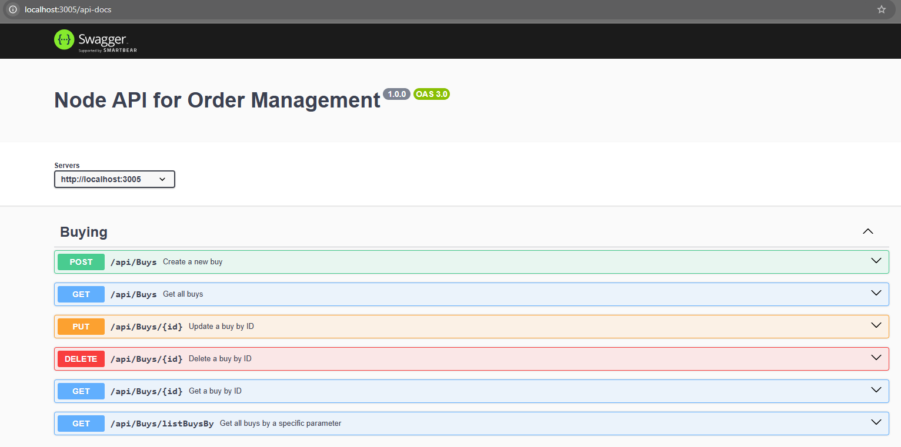

# Proyecto 4: API de Compras

**Proyecto 4: API de Compras** es una aplicación backend desarrollada con **Node.js** y **Express** que gestiona las compras realizadas por clientes en una plataforma. Esta API permite a los usuarios realizar operaciones de compra, como registrar una nueva compra, actualizar la información de una compra existente, eliminar compras y obtener detalles de compras a través de una serie de endpoints RESTful.

Además, la API está completamente documentada utilizando **Swagger**, lo que proporciona una interfaz interactiva para consultar la documentación de los endpoints y probar las operaciones directamente desde la interfaz web.

## Funcionalidad

La API de compras permite gestionar los siguientes recursos:

### Compras
Una **compra** en el sistema contiene la información relacionada con un cliente y los productos que ha adquirido. Cada compra tiene los siguientes atributos:

- **id**: Identificador único de la compra.
- **buyer_name**: Nombre del cliente que realiza la compra.
- **client_id**: Identificador único del cliente (por ejemplo, un RUT en el contexto chileno).
- **address**: Dirección de entrega del cliente.
- **sku**: Identificador del producto comprado.
- **quantity**: Cantidad de unidades del producto adquirido.
- **delivery_date**: Fecha de entrega estimada de la compra.
- **status**: Estado de la compra (por ejemplo, pendiente, completada, cancelada, etc.).

## Persistencia de Datos

El sistema utiliza un archivo **JSON** para almacenar la información de las compras de manera persistente. Los datos se leen y escriben desde un archivo llamado `buys.json`, lo que permite que las compras sean guardadas entre ejecuciones del servidor. La persistencia es gestionada por las siguientes funciones:

### Funciones de persistencia

1. **`readData`**:
   - Lee el archivo `buys.json` y devuelve el contenido en formato JSON. Si el archivo no existe, devuelve un arreglo vacío para que el sistema no falle en el inicio.

2. **`saveData`**:
   - Recibe un arreglo de compras y lo guarda en el archivo `buys.json`. Si hay un error al escribir el archivo, devuelve un mensaje de error.

### Operaciones con Persistencia

Todas las operaciones CRUD (Crear, Leer, Actualizar, Eliminar) sobre las compras interactúan con este archivo JSON:

- **Crear compra (`POST /api/Buys`)**: Los nuevos pedidos se agregan al archivo JSON. Se genera un ID único para cada compra y se inicializa el estado de la compra.
  
- **Listar todas las compras (`GET /api/Buys`)**: Devuelve todas las compras almacenadas en el archivo `buys.json`.
  
- **Actualizar compra (`PUT /api/Buys/{id}`)**: Modifica una compra existente. Si la compra se encuentra, se actualiza y se guarda el archivo nuevamente.
  
- **Eliminar compra (`DELETE /api/Buys/{id}`)**: Elimina una compra del archivo JSON.

## Endpoints de la API

La API ofrece varios endpoints que permiten interactuar con las compras en el sistema:

1. **POST /api/Buys**: Crea una nueva compra. Los datos necesarios incluyen información sobre el cliente, los productos y la cantidad adquirida.
   
2. **GET /api/Buys**: Recupera una lista de todas las compras registradas en el sistema.

3. **GET /api/Buys/{id}**: Recupera una compra específica por su ID. Permite obtener detalles sobre una compra previamente registrada.

4. **PUT /api/Buys/{id}**: Actualiza una compra existente en el sistema utilizando su ID. Se pueden modificar los detalles de la compra, como la dirección de entrega, la cantidad de productos, o el estado.

5. **DELETE /api/Buys/{id}**: Elimina una compra del sistema usando su ID.

6. **GET /api/Buys/listBuysBy**: Permite obtener compras filtradas según parámetros como el ID del cliente, la fecha de entrega, la cantidad de productos, el SKU del producto y el estado de la compra. Esto facilita la búsqueda de compras específicas en el sistema.

## Documentación Interactiva

La API está completamente documentada con **Swagger**, lo que permite visualizar y probar los endpoints de forma interactiva. Puedes acceder a la documentación generada en la siguiente URL de tu servidor:
http://localhost:3005/api-docs

Aquí podrás ver la descripción de cada endpoint, los parámetros que puedes usar en las solicitudes y las respuestas esperadas.

## Casos de Uso

### 1. **Registro de una Compra**
Los clientes pueden realizar compras proporcionando detalles sobre el producto, la cantidad y su dirección de entrega. La API registra la compra y asigna un ID único a cada operación.

### 2. **Consultas de Compras**
Los usuarios pueden consultar todas las compras registradas o buscar compras específicas a través de filtros como el ID del cliente, la fecha de entrega o el estado de la compra.

### 3. **Actualización de Compras**
Las compras pueden ser modificadas, ya sea para corregir errores en la información, cambiar la cantidad de productos o actualizar el estado de la compra.

### 4. **Eliminación de Compras**
Las compras también pueden ser eliminadas si es necesario, lo que puede ser útil en casos de cancelación de pedidos o errores en el registro.

## Estructura del Proyecto

El proyecto está estructurado de manera modular, con el código organizado en controladores y rutas que gestionan las solicitudes de los clientes y interactúan con la base de datos o la lógica de negocio.

- **Rutas**: El archivo de rutas gestiona los diferentes endpoints de la API. Estas rutas reciben las solicitudes HTTP y las pasan a los controladores correspondientes.
- **Controladores**: Los controladores contienen la lógica que maneja las operaciones de las compras, como la creación, lectura, actualización y eliminación de compras.
- **Swagger**: La documentación de la API se genera automáticamente usando Swagger, lo que facilita la exploración y prueba de los endpoints.

## Conclusión

Este proyecto es una implementación práctica de una API para gestionar compras, permitiendo realizar operaciones CRUD (Crear, Leer, Actualizar, Eliminar) sobre las compras de los usuarios. La API está diseñada para ser sencilla de utilizar y cuenta con una documentación interactiva generada con Swagger para facilitar su integración y uso por otros desarrolladores.

Este proyecto es ideal para comprender cómo construir y documentar una API RESTful con Node.js y Express, además de aprender a usar Swagger para documentar la API de manera eficiente.
